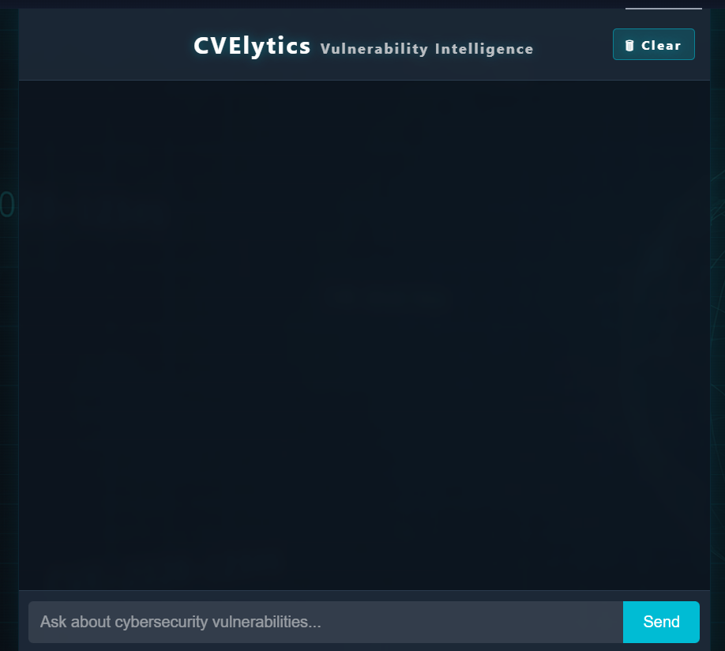

# CVElytics - Cybersecurity Vulnerability Assistant

A cybersecurity question-answering system that uses LLMs to provide information about Common Vulnerabilities and Exposures (CVEs).

## Demo

[View Live Demo](https://huggingface.co/spaces/Surajkumaar/CVElytics)

## Screenshot



## Overview

CVElytics is an AI-powered cybersecurity assistant that helps users query and understand Common Vulnerabilities and Exposures (CVEs). Using advanced language models via OpenRouter and vector search technology, it provides natural language responses to cybersecurity questions with relevant vulnerability information.

## Features

- 🔍 Natural language search across CVE database
- 🔢 Vector-based semantic search for finding relevant vulnerabilities
- 🛡️ Modern, cybersecurity-themed UI with dark mode
- 📝 Markdown formatting for clear, structured responses
- 📋 Copy-to-clipboard functionality for responses
- 🧠 Powered by OpenRouter LLM API for deployment flexibility
- 🔄 Chat history with session persistence
- 🗑️ Clear chat functionality

## Project Structure

```
CVElytics/
├── app.py                  # Main Flask application
├── vector.py               # Vector database and embedding setup
├── main.py                 # Command line interface (CLI)
├── cve.csv                 # Dataset containing CVE information
├── requirements.txt        # Project dependencies
├── .env                    # Environment variables (API keys)
├── static/                 # Static assets
│   ├── style.css           # CSS styling
│   └── images/             # Images for UI and documentation
├── templates/              # HTML templates
│   └── index.html          # Main application interface
├── Dockerfile              # Docker configuration
├── docker-compose.yml      # Docker Compose configuration
└── README.md               # Project documentation
```

## Technologies Used

- **Backend**: Python, Flask
- **LLM Integration**: LangChain, OpenRouter API
- **Vector Database**: Chroma
- **Embeddings**: HuggingFace (sentence-transformers)
- **Frontend**: HTML, CSS, JavaScript
- **Containerization**: Docker, Docker Compose

## Getting Started

### Prerequisites

- Python 3.8+
- OpenRouter API key
- CVE dataset (cve.csv)

### Running Locally

```bash
# Clone the repository
git clone https://github.com/yourusername/CVElytics.git
cd CVElytics

# Create a virtual environment
python -m venv myenv
# On Windows:
myenv\Scripts\activate
# On macOS/Linux:
# source myenv/bin/activate

# Install dependencies
pip install -r requirements.txt

# Create .env file with your OpenRouter API key
echo "OPENROUTER_API_KEY=your_api_key_here" > .env

# Run the application
python app.py
```

The application will be available at http://localhost:7860

## How It Works

1. User enters a cybersecurity-related question in the input field
2. The application uses vector search to find relevant CVE entries
3. The LLM (via OpenRouter) generates a comprehensive answer based on the retrieved CVE data
4. The response is formatted with Markdown and displayed in the chat interface

## Contributing

Contributions are welcome! Please feel free to submit a Pull Request.

## License

This project is licensed under the MIT License - see the LICENSE file for details.

## Acknowledgements

- OpenRouter for providing LLM API access
- HuggingFace for embedding models and hosting capabilities
- LangChain for LLM integration framework
